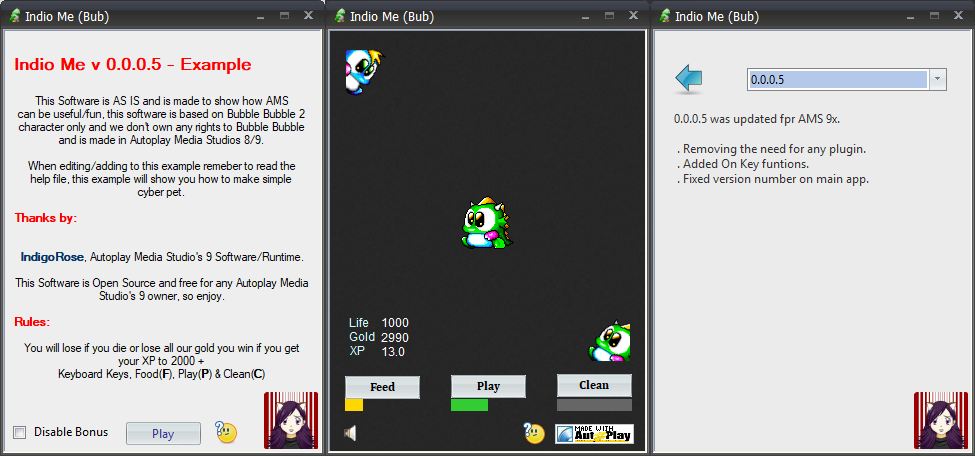

Indio Me
=========================
#### AutoPlay Media Studios 9x Example.
This Example shows you the basics of a cyber pet feed, play and clean.
To win get your XP to 2000+, you can also lose by over feeding your pet or not looking after it.

#### Preview

  

Images could be based on older version, the updated version might look just a little bit different.

#### What is this for
This is for educational reasons, you can use this to learn how to make a basic cyber pet like app
on AutoPlay Media Studios 9x and also learn the basics of some of the plugins used.

#### Needed
* Legal copy of AutoPlay Media Studio's 9x [Here](https://www.indigorose.com/autoplay-media-studio/)
* A Microsft Windows PC or AutPlay Media Studio's working in Wine.
* Time to learn and understand the code provided.
